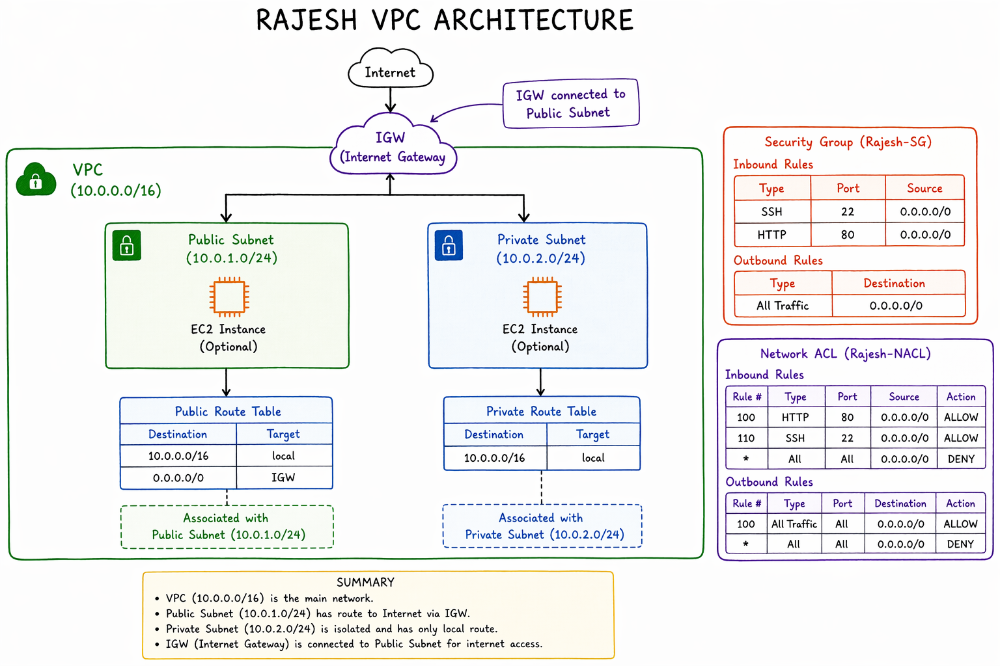
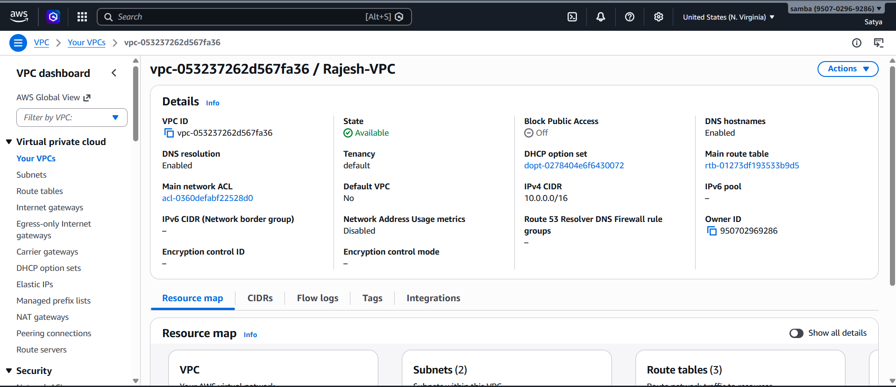
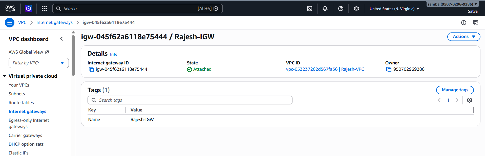
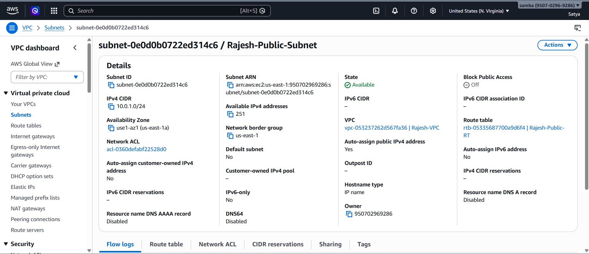
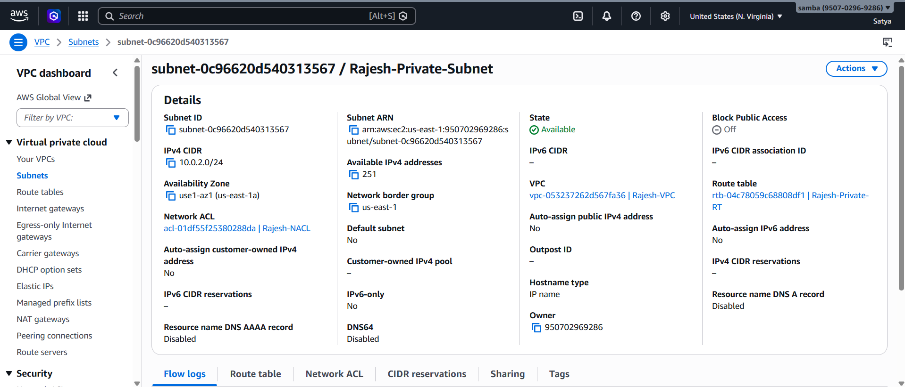
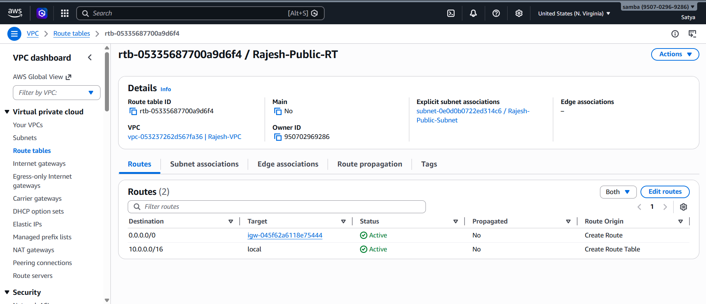
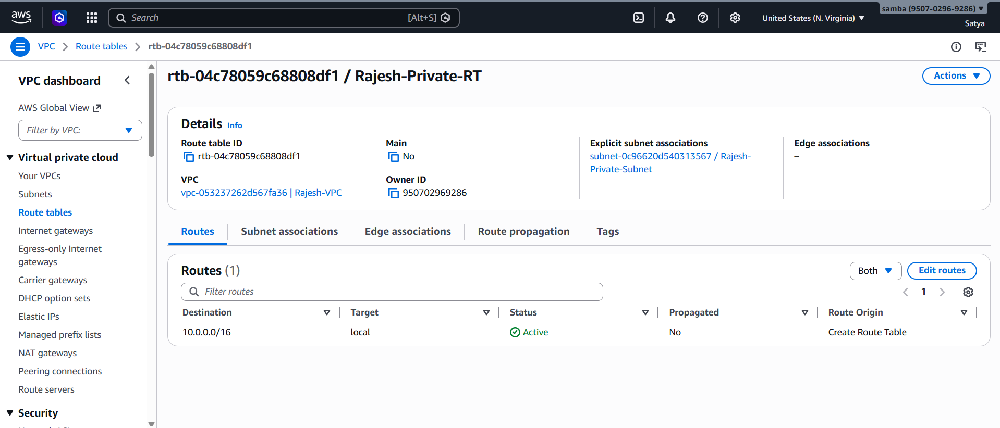
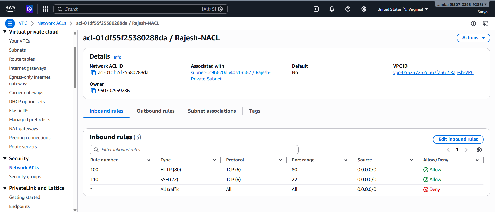
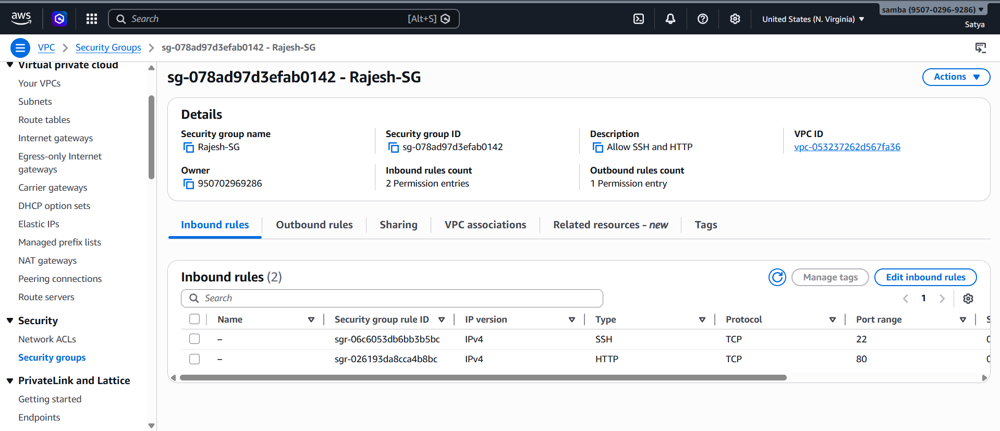
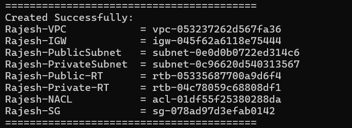

# AWS VPC Infrastructure Setup (Rajesh)

##  Overview

This document explains the step-by-step creation of AWS networking infrastructure using AWS CLI. The setup includes:

* VPC
* Internet Gateway (IGW)
* Public and Private Subnets
* Route Tables
* Network ACL (NACL)
* Security Group (SG)

## Architecture Diagram (Add Screenshot Here)

* VPC (10.0.0.0/16)
* Public Subnet (10.0.1.0/24)
* Private Subnet (10.0.2.0/24)
* IGW connected to Public Subnet

## Step 1: Create VPC

Command used:

    aws ec2 create-vpc --cidr-block 10.0.0.0/16

* AWS Console → VPC → Your created VPC (Rajesh-VPC)

## Step 2: Create Internet Gateway

Command used:

    aws ec2 create-internet-gateway

* IGW attached to VPC

## Step 3: Create Public Subnet

Command used:

    aws ec2 create-subnet --cidr-block 10.0.1.0/24

* Public subnet details
* "Auto-assign public IP" enabled

##  Step 4: Create Private Subnet

Command used:

    aws ec2 create-subnet --cidr-block 10.0.2.0/24

* Private subnet details

## Step 5: Create Route Tables

### Public Route Table

* Route: 0.0.0.0/0 → IGW

* Route table showing IGW route

### Private Route Table

* No internet route

* Private route table

## Step 6: Create Network ACL

* Allow HTTP (80)
* Allow SSH (22)

* Inbound rules
* Outbound rules

## Step 7: Create Security Group

* Allow SSH (22)
* Allow HTTP (80)

* Security group inbound rules

## Final Output

Include terminal output:

    Created Successfully:
    Rajesh-VPC
    Rajesh-IGW
    Rajesh-PublicSubnet
    Rajesh-PrivateSubnet
    Rajesh-SG

* Final CLI output

## Key Concepts

* Public subnet has internet access via IGW
* Private subnet is isolated
* Security Groups are stateful
* NACLs are stateless

##  Conclusion

This project demonstrates how to build a complete AWS networking setup using AWS CLI. It is useful for understanding real-world cloud architecture and DevOps practices.

